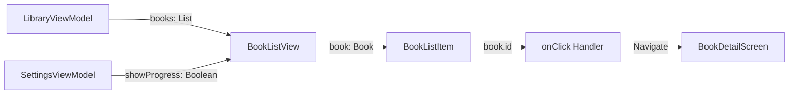

# 设计文档

## 概述

本设计文档描述了如何美化库布局中的列表视图，通过增强视觉效果和信息展示来提升用户体验。设计遵循 Material 3 设计规范，并与现有的 Expressive 设计系统保持一致。

## 架构

### 组件层次结构

```
LibraryScreen
└── BookListView (LazyColumn)
    └── BookListItem (ExpressiveCard)
        ├── CoverSection (封面区域)
        │   ├── CoverImage (封面图片)
        │   └── StatusBadge (状态标签)
        └── InfoSection (信息区域)
            ├── TitleText (标题)
            ├── AuthorText (作者)
            ├── MetadataRow (元数据行)
            │   ├── PageCount (页数)
            │   └── FileFormat (文件格式)
            └── ProgressSection (进度区域)
                ├── ProgressBar (进度条)
                └── ProgressText (进度文本)
```

### 数据流



## 组件和接口

### 1. BookListItem 组件

#### 接口定义

```kotlin
@Composable
fun BookListItem(
    book: Book,
    showProgress: Boolean = true,
    onClick: () -> Unit,
    modifier: Modifier = Modifier
)
```

#### 参数说明

- `book`: 书籍数据模型，包含所有需要显示的信息
- `showProgress`: 是否显示阅读进度，默认为 true
- `onClick`: 点击回调函数，用于导航到书籍详情页
- `modifier`: 修饰符，用于自定义样式

#### 布局结构

使用 `ExpressiveCard` 作为容器，内部使用 `Row` 布局：

```
┌─────────────────────────────────────────────────┐
│ ExpressiveCard (16dp padding)                   │
│ ┌──────────┬──────────────────────────────────┐ │
│ │          │ Title (2 lines max)              │ │
│ │  Cover   │ Author (if available)            │ │
│ │ 120x180  │ PageCount | FileFormat           │ │
│ │   dp     │ ProgressBar + ProgressText       │ │
│ │          │                                  │ │
│ └──────────┴──────────────────────────────────┘ │
└─────────────────────────────────────────────────┘
```

### 2. CoverSection 组件

#### 设计规格

- **尺寸**: 120dp × 180dp（宽高比 2:3）
- **圆角**: 12dp（使用 MaterialTheme.shapes.medium）
- **内容缩放**: ContentScale.Crop
- **占位符**: 当没有封面时显示 Book 图标（48dp）

#### 实现细节

```kotlin
Box(
    modifier = Modifier
        .width(120.dp)
        .height(180.dp)
        .clip(MaterialTheme.shapes.medium),
    contentAlignment = Alignment.Center
) {
    if (book.coverPath != null) {
        AsyncImage(
            model = ImageRequest.Builder(LocalContext.current)
                .data(book.coverPath)
                .crossfade(300)
                .memoryCacheKey(book.id.toString())
                .build(),
            contentDescription = book.title,
            modifier = Modifier.fillMaxSize(),
            contentScale = ContentScale.Crop
        )
    } else {
        Icon(
            Icons.Default.Book,
            contentDescription = null,
            modifier = Modifier.size(48.dp),
            tint = MaterialTheme.colorScheme.primary
        )
    }
    
    // 状态标签（左上角）
    StatusBadge(
        book = book,
        modifier = Modifier
            .align(Alignment.TopStart)
            .padding(8.dp)
    )
}
```

### 3. StatusBadge 组件

#### 状态类型和颜色

| 状态 | 颜色 | 文本 |
|------|------|------|
| 未读 (UNREAD) | #C62828 (深红色) | "未读" |
| 阅读中 (READING) | #4CAF50 (绿色) | "阅读中" + 进度百分比 |
| 已读 (FINISHED) | #2196F3 (蓝色) | "已读" |
| 最新 (LATEST) | #FF5722 (橙红色) | "最新" |

#### 连接式标签设计（阅读中状态）

对于"阅读中"状态，使用连接式标签显示状态和进度：

```
┌──────────┬────────┐
│ 阅读中   │  45%   │
└──────────┴────────┘
```

- 左侧：状态文字（绿色背景 #4CAF50）
- 右侧：进度百分比（深绿色背景 #2E7D32）
- 无缝连接，左侧圆角，右侧圆角

#### 实现细节

```kotlin
@Composable
fun StatusBadge(
    book: Book,
    modifier: Modifier = Modifier
) {
    val readingStatus = book.getReadingStatus()
    
    if (readingStatus == BookReadingStatus.READING) {
        // 连接式标签
        ConnectedReadingStatusBadge(
            statusText = stringResource(R.string.status_reading),
            progressPercentage = (book.currentPage.toFloat() / book.totalPages * 100).toInt(),
            modifier = modifier
        )
    } else {
        // 普通标签
        Surface(
            modifier = modifier,
            shape = MaterialTheme.shapes.small,
            color = when (readingStatus) {
                BookReadingStatus.FINISHED -> Color(0xFF2196F3)
                BookReadingStatus.LATEST -> Color(0xFFFF5722)
                BookReadingStatus.UNREAD -> Color(0xFFC62828)
                else -> MaterialTheme.colorScheme.surfaceVariant
            }
        ) {
            Text(
                text = when (readingStatus) {
                    BookReadingStatus.FINISHED -> stringResource(R.string.status_finished)
                    BookReadingStatus.LATEST -> stringResource(R.string.status_latest)
                    BookReadingStatus.UNREAD -> stringResource(R.string.status_unread)
                    else -> ""
                },
                style = MaterialTheme.typography.labelSmall,
                color = Color.White,
                modifier = Modifier.padding(horizontal = 8.dp, vertical = 4.dp)
            )
        }
    }
}
```

### 4. InfoSection 组件

#### 布局结构

使用 `Column` 垂直排列信息元素：

```kotlin
Column(
    modifier = Modifier
        .weight(1f)
        .fillMaxHeight(),
    verticalArrangement = Arrangement.SpaceBetween
) {
    // 标题
    Text(
        text = book.title,
        style = MaterialTheme.typography.titleMedium,
        maxLines = 2,
        overflow = TextOverflow.Ellipsis
    )
    
    Spacer(modifier = Modifier.height(4.dp))
    
    // 作者（如果有）
    book.author?.let {
        Text(
            text = it,
            style = MaterialTheme.typography.bodyMedium,
            color = MaterialTheme.colorScheme.onSurfaceVariant,
            maxLines = 1,
            overflow = TextOverflow.Ellipsis
        )
        Spacer(modifier = Modifier.height(4.dp))
    }
    
    // 元数据行
    MetadataRow(book = book)
    
    // 阅读进度
    if (showProgress && book.currentPage > 0) {
        Spacer(modifier = Modifier.height(8.dp))
        ProgressSection(book = book)
    }
}
```

#### 文本样式

- **标题**: MaterialTheme.typography.titleMedium
  - 最多 2 行
  - 超出部分显示省略号
  
- **作者**: MaterialTheme.typography.bodyMedium
  - 颜色: MaterialTheme.colorScheme.onSurfaceVariant
  - 最多 1 行
  
- **元数据**: MaterialTheme.typography.bodySmall
  - 颜色: MaterialTheme.colorScheme.onSurfaceVariant
  - 页数和文件格式用 8dp 间距分隔

### 5. ProgressSection 组件

#### 设计规格

- **进度条高度**: 6dp（比默认的 4dp 更明显）
- **进度条颜色**: MaterialTheme.colorScheme.primary
- **进度文本**: "当前页/总页数"（例如："3/112"）
- **布局**: 进度条和文本水平排列，进度条占据剩余空间

#### 实现细节

```kotlin
@Composable
fun ProgressSection(
    book: Book,
    modifier: Modifier = Modifier
) {
    Row(
        modifier = modifier.fillMaxWidth(),
        verticalAlignment = Alignment.CenterVertically,
        horizontalArrangement = Arrangement.spacedBy(8.dp)
    ) {
        LinearProgressIndicator(
            progress = { book.currentPage.toFloat() / book.totalPages.coerceAtLeast(1) },
            modifier = Modifier
                .weight(1f)
                .height(6.dp)
                .clip(MaterialTheme.shapes.small),
            color = MaterialTheme.colorScheme.primary,
            trackColor = MaterialTheme.colorScheme.surfaceVariant
        )
        
        Text(
            text = "${book.currentPage}/${book.totalPages}",
            style = MaterialTheme.typography.bodySmall,
            color = MaterialTheme.colorScheme.primary
        )
    }
}
```

### 6. MetadataRow 组件

#### 实现细节

```kotlin
@Composable
fun MetadataRow(
    book: Book,
    modifier: Modifier = Modifier
) {
    Row(
        modifier = modifier,
        horizontalArrangement = Arrangement.spacedBy(8.dp)
    ) {
        Text(
            text = "${book.totalPages} 页",
            style = MaterialTheme.typography.bodySmall,
            color = MaterialTheme.colorScheme.onSurfaceVariant
        )
        
        Text(
            text = book.fileFormat.name,
            style = MaterialTheme.typography.bodySmall,
            color = MaterialTheme.colorScheme.primary
        )
    }
}
```

## 数据模型

### Book 模型（现有）

```kotlin
data class Book(
    val id: Long,
    val title: String,
    val filePath: String,
    val fileSize: Long,
    val fileFormat: BookFormat,
    val coverPath: String?,
    val author: String?,
    val publisher: String?,
    val description: String?,
    val totalPages: Int,
    val currentPage: Int,
    val isFinished: Boolean,
    val isFavorite: Boolean,
    val category: String?,
    val tags: List<String>,
    val addedAt: Long,
    val lastReadAt: Long?,
    val lastModifiedAt: Long
)
```

### BookReadingStatus 枚举（现有）

```kotlin
enum class BookReadingStatus {
    UNREAD,    // 未读
    READING,   // 阅读中
    FINISHED,  // 已读
    LATEST     // 最新
}
```

## 错误处理

### 封面加载失败

- **场景**: 封面图片路径无效或文件不存在
- **处理**: 显示默认的 Book 图标占位符
- **实现**: AsyncImage 的 error 参数自动处理

### 数据缺失

- **作者信息缺失**: 不显示作者行，自动调整布局
- **页数为 0**: 不显示进度条，避免除零错误
- **封面路径为 null**: 显示默认图标

### 性能问题

- **大量书籍**: 使用 LazyColumn 虚拟化滚动
- **图片内存**: 使用 Coil 的内存缓存和磁盘缓存
- **滚动卡顿**: 避免在 Composable 中进行复杂计算

## 测试策略

### 单元测试

1. **StatusBadge 逻辑测试**
   - 测试不同阅读状态返回正确的颜色和文本
   - 测试进度百分比计算的准确性

2. **ProgressSection 计算测试**
   - 测试进度条百分比计算
   - 测试边界情况（currentPage = 0, totalPages = 0）

### UI 测试

1. **BookListItem 渲染测试**
   - 测试有封面和无封面的情况
   - 测试有作者和无作者的情况
   - 测试不同阅读状态的显示

2. **交互测试**
   - 测试点击列表项触发 onClick 回调
   - 测试 ExpressiveCard 的动画效果

### 集成测试

1. **BookListView 滚动测试**
   - 测试大量书籍的滚动性能
   - 测试图片加载和缓存

2. **设置联动测试**
   - 测试 showProgress 设置的影响
   - 测试布局切换功能

## 性能优化

### 图片加载优化

1. **使用 Coil 的内存缓存**
   ```kotlin
   .memoryCacheKey(book.id.toString())
   ```

2. **启用 crossfade 动画**
   ```kotlin
   .crossfade(300)
   ```

3. **合理的图片尺寸**
   - 封面尺寸固定为 120dp × 180dp
   - 避免加载过大的图片

### 列表滚动优化

1. **使用 LazyColumn**
   - 只渲染可见的列表项
   - 自动回收不可见的视图

2. **设置唯一的 key**
   ```kotlin
   items(books.size, key = { books[it].id })
   ```

3. **避免复杂计算**
   - 在 ViewModel 中预计算状态
   - 使用 remember 缓存计算结果

### 动画性能

1. **使用 ExpressiveCard**
   - 利用现有的优化动画
   - 避免自定义复杂动画

2. **限制动画范围**
   - 只对必要的元素应用动画
   - 使用硬件加速

## 可访问性

### 语义化标签

1. **内容描述**
   - 封面图片: 使用书籍标题作为 contentDescription
   - 状态标签: 提供状态文本的语义描述

2. **角色定义**
   - 列表项: 定义为可点击的按钮角色
   - 进度条: 提供进度百分比的语义信息

### 对比度

1. **文本对比度**
   - 标题: 使用 onSurface 颜色，确保高对比度
   - 次要文本: 使用 onSurfaceVariant，保持可读性

2. **状态标签对比度**
   - 所有状态标签使用白色文字
   - 背景颜色确保至少 4.5:1 的对比度

### 触摸目标

1. **最小触摸区域**
   - 整个列表项可点击
   - 确保至少 48dp 的触摸目标高度

## 国际化

### 字符串资源

需要添加以下字符串资源：

```xml
<!-- 状态标签 -->
<string name="status_unread">未读</string>
<string name="status_reading">阅读中</string>
<string name="status_finished">已读</string>
<string name="status_latest">最新</string>

<!-- 元数据 -->
<string name="pages_format">%d 页</string>
<string name="progress_format">%d/%d</string>
```

### 布局适配

1. **RTL 支持**
   - 使用 Row 的自动 RTL 布局
   - 确保封面和文本的顺序正确

2. **长文本处理**
   - 标题最多 2 行，超出显示省略号
   - 作者最多 1 行，超出显示省略号

## 主题适配

### 明暗主题

1. **颜色自适应**
   - 使用 MaterialTheme.colorScheme 中的颜色
   - 确保在明暗主题下都有良好的对比度

2. **状态标签颜色**
   - 使用固定的颜色值，确保在两种主题下都清晰可见

### 动态颜色

1. **支持 Material You**
   - 进度条使用 primary 颜色
   - 文件格式文本使用 primary 颜色
   - 与用户的壁纸颜色协调

## 实现计划

### 阶段 1: 基础布局

1. 更新 BookListItem 组件的布局结构
2. 实现封面区域的圆角和尺寸调整
3. 实现信息区域的垂直布局

### 阶段 2: 状态标签

1. 实现 StatusBadge 组件
2. 实现连接式标签（阅读中状态）
3. 添加状态颜色和文本

### 阶段 3: 进度显示

1. 实现 ProgressSection 组件
2. 调整进度条高度和样式
3. 添加进度文本显示

### 阶段 4: 优化和测试

1. 性能优化（图片加载、滚动）
2. 可访问性改进
3. 单元测试和 UI 测试
4. 国际化支持

## 设计决策

### 为什么选择 120dp × 180dp 的封面尺寸？

- **原因**: 这个尺寸提供了良好的视觉平衡，既足够大以识别封面，又不会占用过多空间
- **参考**: 参考了图片中的封面尺寸比例
- **备选方案**: 可以在设置中提供封面尺寸选项

### 为什么使用连接式标签显示阅读进度？

- **原因**: 连接式标签将状态和进度无缝结合，节省空间并提高信息密度
- **参考**: 参考了图片中的标签设计
- **备选方案**: 可以使用单独的标签和进度文本

### 为什么进度条高度设置为 6dp？

- **原因**: 6dp 的高度比默认的 4dp 更明显，提高了可见性
- **参考**: Material 3 设计规范建议的进度条高度范围
- **备选方案**: 可以使用 4dp 或 8dp

### 为什么作者信息是可选的？

- **原因**: 不是所有书籍都有作者信息，需要优雅地处理缺失情况
- **实现**: 使用 Kotlin 的 null 安全特性和 let 操作符
- **备选方案**: 显示"未知作者"占位文本
