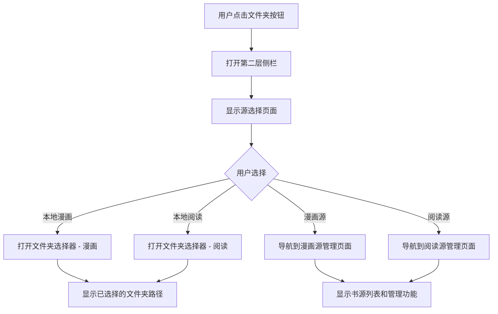

# Design Document

## Overview

本设计文档描述了书库源选择页面的实现方案。该功能将改变当前的文件选择交互模式，从直接打开系统文件夹选择器改为在第二层侧栏中显示一个专门的选择页面。用户可以在该页面中选择"本地漫画"、"本地阅读"、"漫画源"、"阅读源"等不同类型的内容源。

该设计遵循 Material 3 Expressive 设计原则，与现有的两层导航抽屉系统无缝集成，提供流畅的用户体验。

## Architecture

### 系统架构

```
TwoLayerNavigationScaffold
├── PrimaryNavigationRail (第一层)
│   └── FolderOpen Button (触发源选择页面)
└── SecondaryDrawer (第二层)
    ├── LibraryDrawerContent (现有)
    ├── SettingsDrawerContent (现有)
    ├── AboutDrawerContent (现有)
    └── SourceSelectionContent (新增) ← 本功能
        ├── LocalSourceSection
        │   ├── LocalMangaOption
        │   └── LocalReadingOption
        └── OnlineSourceSection
            ├── MangaSourceOption
            └── ReadingSourceOption
```

### 导航流程



## Components and Interfaces

### 1. SourceSelectionContent (新组件)

主要的源选择页面组件，在第二层侧栏中显示。

```kotlin
@Composable
fun SourceSelectionContent(
    selectedLocalMangaPath: String?,
    selectedLocalReadingPath: String?,
    onLocalMangaClick: () -> Unit,
    onLocalReadingClick: () -> Unit,
    onMangaSourceClick: () -> Unit,
    onReadingSourceClick: () -> Unit,
    modifier: Modifier = Modifier
)
```

**职责：**
- 显示四个主要选项：本地漫画、本地阅读、漫画源、阅读源
- 显示已选择的本地文件夹路径
- 处理用户点击事件
- 应用 M3E 设计风格

### 2. SourceSelectionOption (新组件)

单个源选择选项的可复用组件。

```kotlin
@Composable
fun SourceSelectionOption(
    icon: ImageVector,
    title: String,
    subtitle: String?,
    onClick: () -> Unit,
    modifier: Modifier = Modifier,
    showChevron: Boolean = false
)
```

**职责：**
- 显示图标、标题和可选的副标题
- 提供点击交互
- 可选显示右侧箭头（用于导航到子页面）
- 应用 M3E 卡片样式和动画

### 3. NavigationState 扩展

扩展现有的 NavigationState 以支持源选择页面。

```kotlin
data class NavigationState(
    val selectedPrimaryItem: PrimaryNavItem = PrimaryNavItem.LocalLibrary,
    val isSecondaryDrawerOpen: Boolean = false,
    val selectedSecondaryItem: String? = null,
    val showSourceSelection: Boolean = false  // 新增
)
```

### 4. SourceSelectionViewModel (新 ViewModel)

管理源选择页面的状态和业务逻辑。

```kotlin
class SourceSelectionViewModel(application: Application) : AndroidViewModel(application) {
    private val _selectedLocalMangaPath = MutableStateFlow<String?>(null)
    val selectedLocalMangaPath: StateFlow<String?> = _selectedLocalMangaPath.asStateFlow()
    
    private val _selectedLocalReadingPath = MutableStateFlow<String?>(null)
    val selectedLocalReadingPath: StateFlow<String?> = _selectedLocalReadingPath.asStateFlow()
    
    fun updateLocalMangaPath(path: String)
    fun updateLocalReadingPath(path: String)
    fun clearLocalMangaPath()
    fun clearLocalReadingPath()
}
```

### 5. TwoLayerNavigationScaffold 修改

修改现有的 TwoLayerNavigationScaffold 以支持源选择页面。

**修改点：**
- 将 `onFolderPickerClick` 改为 `onSourceSelectionClick`
- 在 SecondaryDrawer 中添加源选择页面的显示逻辑
- 添加状态管理以控制源选择页面的显示/隐藏

## Data Models

### 1. SourceType (新枚举)

定义不同类型的内容源。

```kotlin
enum class SourceType {
    LOCAL_MANGA,      // 本地漫画
    LOCAL_READING,    // 本地阅读
    MANGA_SOURCE,     // 漫画源
    READING_SOURCE    // 阅读源
}
```

### 2. LocalSourceConfig (新数据类)

存储本地源的配置信息。

```kotlin
data class LocalSourceConfig(
    val mangaPath: String? = null,
    val readingPath: String? = null,
    val lastUpdated: Long = System.currentTimeMillis()
)
```

### 3. SourceSelectionRepository (新 Repository)

使用 DataStore 持久化本地源配置。

```kotlin
class SourceSelectionRepository(private val context: Context) {
    private val dataStore: DataStore<Preferences> = context.createDataStore(
        name = "source_selection_prefs"
    )
    
    suspend fun saveLocalMangaPath(path: String)
    suspend fun saveLocalReadingPath(path: String)
    fun getLocalMangaPath(): Flow<String?>
    fun getLocalReadingPath(): Flow<String?>
}
```

## UI Design

### 源选择页面布局

```
┌─────────────────────────────────┐
│  源选择                          │  ← 标题
├─────────────────────────────────┤
│                                 │
│  📁 本地漫画                     │  ← 卡片样式
│  /storage/emulated/0/Manga      │  ← 已选择的路径
│                                 │
│  📖 本地阅读                     │
│  未选择文件夹                    │
│                                 │
│  ☁️ 漫画源                    →  │  ← 带箭头表示子页面
│  管理在线漫画书源                │
│                                 │
│  ☁️ 阅读源                    →  │
│  管理在线阅读书源                │
│                                 │
└─────────────────────────────────┘
```

### Material 3 Expressive 设计元素

1. **卡片样式**
   - 使用 `Card` 组件，带圆角和轻微阴影
   - 背景色：`surfaceVariant.copy(alpha = 0.3f)`
   - 形状：`MaterialTheme.shapes.large`

2. **图标**
   - 本地漫画：`Icons.Default.Book`
   - 本地阅读：`Icons.AutoMirrored.Filled.MenuBook`
   - 漫画源：`Icons.Default.CloudQueue`
   - 阅读源：`Icons.Default.CloudQueue`
   - 导航箭头：`Icons.Default.ChevronRight`

3. **排版**
   - 标题：`MaterialTheme.typography.headlineSmall`
   - 选项标题：`MaterialTheme.typography.bodyLarge`
   - 副标题/路径：`MaterialTheme.typography.bodyMedium`

4. **动画**
   - 页面进入：`fadeIn` + `slideInHorizontally`
   - 页面退出：`fadeOut` + `slideOutHorizontally`
   - 卡片点击：涟漪效果 (Ripple)
   - 持续时间：使用 `ExpressiveAnimations.DURATION_SHORT`

5. **间距**
   - 卡片间距：`vertical = 8.dp`
   - 卡片内边距：`16.dp`
   - 图标与文字间距：`16.dp`

## Integration Points

### 1. 与 TwoLayerNavigationScaffold 集成

**修改文件：** `app/src/main/java/takagi/ru/paysage/navigation/TwoLayerNavigationScaffold.kt`

- 在 `CompactNavigationLayout` 中，将文件夹按钮的点击事件改为打开源选择页面
- 在 `SecondaryDrawerContent` 中添加源选择页面的显示逻辑
- 使用 `AnimatedContent` 实现页面切换动画

### 2. 与文件夹选择器集成

**修改文件：** `app/src/main/java/takagi/ru/paysage/MainActivity.kt`

- 添加两个不同的文件夹选择器启动器（漫画和阅读）
- 根据选择类型保存不同的路径
- 更新 ViewModel 中的路径状态

### 3. 与在线书源管理集成

**现有文件：** `app/src/main/java/takagi/ru/paysage/ui/screens/OnlineSourceScreen.kt`

- 从源选择页面导航到在线书源管理页面
- 传递 `category` 参数（manga 或 novel）
- 保持现有的书源管理功能不变

### 4. 与书库扫描集成

**修改文件：** `app/src/main/java/takagi/ru/paysage/viewmodel/LibraryViewModel.kt`

- 根据选择的本地路径进行文件扫描
- 区分漫画和阅读文件的扫描逻辑
- 更新扫描结果到数据库

## Error Handling

### 1. 文件夹访问权限

```kotlin
sealed class SourceSelectionError {
    object PermissionDenied : SourceSelectionError()
    object InvalidPath : SourceSelectionError()
    object NetworkError : SourceSelectionError()
    data class Unknown(val message: String) : SourceSelectionError()
}
```

**处理策略：**
- 权限被拒绝：显示 Snackbar 提示用户授予权限
- 无效路径：清除保存的路径，提示用户重新选择
- 网络错误：在线书源页面显示错误状态
- 未知错误：记录日志并显示通用错误消息

### 2. 路径验证

```kotlin
fun validatePath(path: String): Boolean {
    val file = File(path)
    return file.exists() && file.isDirectory && file.canRead()
}
```

### 3. 错误提示

使用 Snackbar 显示错误消息：
- 位置：屏幕底部
- 持续时间：`SnackbarDuration.Short`
- 样式：Material 3 Snackbar

## Testing Strategy

### 1. 单元测试

**测试文件：** `app/src/test/java/takagi/ru/paysage/viewmodel/SourceSelectionViewModelTest.kt`

测试内容：
- ViewModel 状态更新
- 路径保存和读取
- 路径验证逻辑
- 错误处理

### 2. UI 测试

**测试文件：** `app/src/androidTest/java/takagi/ru/paysage/navigation/SourceSelectionUITest.kt`

测试内容：
- 源选择页面显示
- 选项点击交互
- 页面切换动画
- 路径显示更新

### 3. 集成测试

**测试文件：** `app/src/androidTest/java/takagi/ru/paysage/SourceSelectionIntegrationTest.kt`

测试内容：
- 从导航按钮到源选择页面的完整流程
- 文件夹选择器集成
- 在线书源页面导航
- 数据持久化

## Accessibility

### 1. 内容描述

所有交互元素都提供清晰的 `contentDescription`：
- 本地漫画选项：`context.getString(R.string.source_local_manga_desc)`
- 本地阅读选项：`context.getString(R.string.source_local_reading_desc)`
- 漫画源选项：`context.getString(R.string.source_manga_source_desc)`
- 阅读源选项：`context.getString(R.string.source_reading_source_desc)`

### 2. 触摸目标

所有可点击元素的最小触摸目标为 48dp × 48dp。

### 3. 语义标签

使用 `semantics` 修饰符提供额外的语义信息：
```kotlin
.semantics {
    role = Role.Button
    contentDescription = "..."
}
```

### 4. 键盘导航

支持键盘导航（用于外接键盘或辅助设备）：
- Tab 键在选项间切换
- Enter 键激活选中的选项

## Localization

### 新增字符串资源

**文件：** `app/src/main/res/values/strings.xml`

```xml
<!-- Source Selection -->
<string name="source_selection_title">Source Selection</string>
<string name="source_local_manga">Local Manga</string>
<string name="source_local_reading">Local Reading</string>
<string name="source_manga_source">Manga Sources</string>
<string name="source_reading_source">Reading Sources</string>
<string name="source_no_folder_selected">No folder selected</string>
<string name="source_manage_online_manga">Manage online manga sources</string>
<string name="source_manage_online_reading">Manage online reading sources</string>
<string name="source_local_manga_desc">Select local manga folder</string>
<string name="source_local_reading_desc">Select local reading folder</string>
<string name="source_manga_source_desc">Manage manga sources</string>
<string name="source_reading_source_desc">Manage reading sources</string>
<string name="source_permission_denied">Storage permission denied</string>
<string name="source_invalid_path">Invalid folder path</string>
```

**文件：** `app/src/main/res/values-zh/strings.xml`

```xml
<!-- Source Selection -->
<string name="source_selection_title">源选择</string>
<string name="source_local_manga">本地漫画</string>
<string name="source_local_reading">本地阅读</string>
<string name="source_manga_source">漫画源</string>
<string name="source_reading_source">阅读源</string>
<string name="source_no_folder_selected">未选择文件夹</string>
<string name="source_manage_online_manga">管理在线漫画书源</string>
<string name="source_manage_online_reading">管理在线阅读书源</string>
<string name="source_local_manga_desc">选择本地漫画文件夹</string>
<string name="source_local_reading_desc">选择本地阅读文件夹</string>
<string name="source_manga_source_desc">管理漫画书源</string>
<string name="source_reading_source_desc">管理阅读书源</string>
<string name="source_permission_denied">存储权限被拒绝</string>
<string name="source_invalid_path">无效的文件夹路径</string>
```

## Performance Considerations

### 1. 状态管理

- 使用 `StateFlow` 管理路径状态，避免不必要的重组
- 使用 `remember` 缓存不变的数据
- 使用 `derivedStateOf` 计算派生状态

### 2. 动画性能

- 使用硬件加速的动画
- 避免在动画期间进行复杂计算
- 使用 `animateContentSize` 实现流畅的尺寸变化

### 3. 数据持久化

- 使用 DataStore 异步保存数据，避免阻塞 UI 线程
- 批量更新配置，减少 I/O 操作
- 使用 Flow 监听数据变化，自动更新 UI

## Migration Strategy

### 阶段 1：创建新组件（不影响现有功能）

1. 创建 `SourceSelectionContent.kt`
2. 创建 `SourceSelectionViewModel.kt`
3. 创建 `SourceSelectionRepository.kt`
4. 添加字符串资源

### 阶段 2：集成到导航系统

1. 修改 `NavigationState.kt` 添加新状态
2. 修改 `TwoLayerNavigationScaffold.kt` 集成源选择页面
3. 保留原有的 `onFolderPickerClick` 作为后备

### 阶段 3：更新 MainActivity

1. 添加源选择页面的导航逻辑
2. 更新文件夹选择器集成
3. 测试完整流程

### 阶段 4：清理和优化

1. 移除旧的直接文件夹选择逻辑
2. 优化动画和性能
3. 完善错误处理

## Future Enhancements

### 1. 多文件夹支持

允许用户为每种类型选择多个文件夹：
- 本地漫画：多个漫画文件夹
- 本地阅读：多个阅读文件夹

### 2. 文件夹快速切换

在源选择页面显示最近使用的文件夹列表，支持快速切换。

### 3. 自动扫描

选择文件夹后自动触发扫描，无需手动操作。

### 4. 文件夹统计

显示每个文件夹的书籍数量和总大小。

### 5. 云存储集成

支持从云存储服务（如 Google Drive、Dropbox）选择文件夹。
